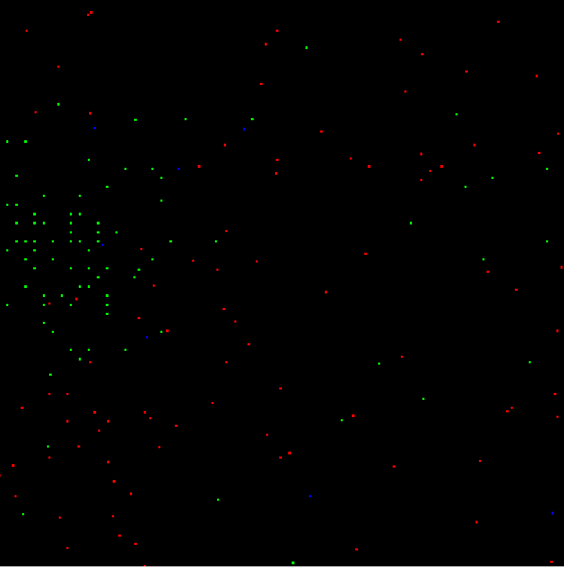

# Population growth model

A population growth model and simulation of three species in a forest. The defined interactions between species affects their number and survival. It can be used to produce more realistic scenario with real world parameters to depict the survival of certain species co-existing together

## Species Modelled

Foxes

Rabbits

Mushrooms(with some magic powers)

## Want to _Run_ it Yourself?!

Simply clone the repo and run the populationGrowthModel.m file.

## Simulation screenshot

Click on the image below to watch the simulation video on YouTube.

